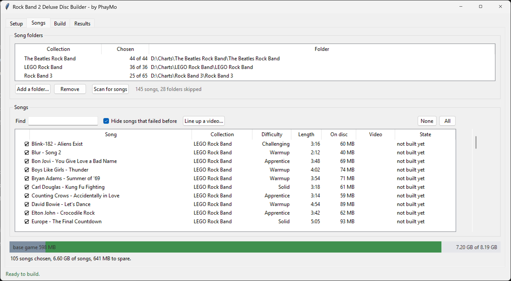
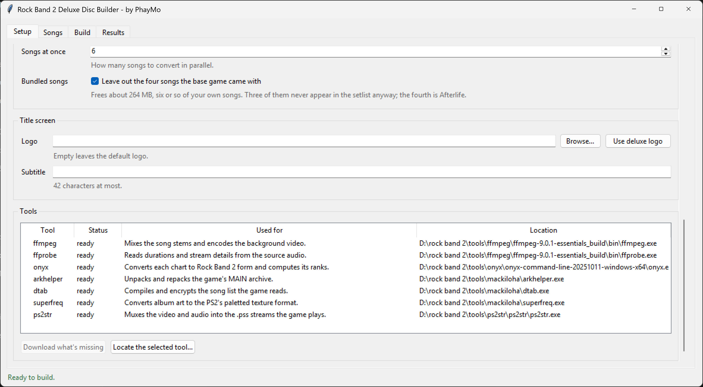
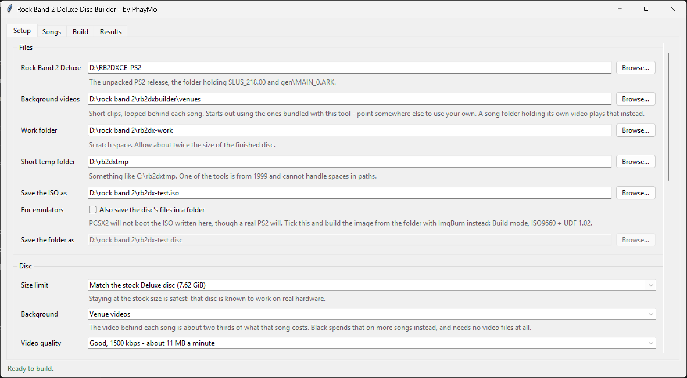

# Rock Band 2 Deluxe Disc Builder

by PhayMo

Builds a custom Rock Band 2 Deluxe disc for the PlayStation 2 from folders of
Clone Hero songs. You choose the songs, it converts the audio, charts, album art
and background video into the formats the console expects, packs them into the
game's archive and writes a bootable ISO.

Everything it produces has been tested on real hardware.

## What you need

**Windows.** The chart converter runs Magma, the official Rock Band compiler,
which is a Windows program.

**Python 3.8 or newer**, from [python.org](https://www.python.org/downloads/),
if you are running from the source. Tick *Add Python to PATH* during setup. The
packaged `.exe` needs nothing installed.

**Your own copy of Rock Band 2 Deluxe for PS2**, unpacked to a folder - the one
containing `SLUS_218.00` and `gen\MAIN_0.ARK`. This tool does not include any
game files.

**Songs in Clone Hero layout**: one folder per song holding `notes.mid` (or
`notes.chart`), `song.ini`, the audio, and `album.png`. Separate stems such as
`guitar.ogg` and `drums_1.ogg` are ideal, since the game can then mute each part
as it is missed, but a single mixed `song.ogg` works too - as do `.wav`, `.mp3`
and `.opus`. With one mixed file the whole song plays from the backing track, so
missed notes do not drop out.

A song offers exactly the parts its chart plays: a guitar-only chart becomes a
guitar-only song, and its disc space goes down accordingly. Stems for a part the
chart skips are not wasted - they are mixed into the backing track, so the song
still sounds complete. Lyrics on their own are not a vocals part; most Clone Hero
charts carry them just to show the words.

**Background videos** are included - eleven short clips in `venues\`, one picked
per song and looped behind it. Drop your own files in that folder, or point the
Setup page at a different one. They only need to be a few seconds long.

A song that brings its own video plays that instead, the way Clone Hero does it:
a file named `video` or `background` in the song folder, in any format Clone Hero
accepts for an animated background - `.mp4`, `.avi`, `.webm`, `.ogv`, `.mpeg` -
or `.mkv`, `.mov`, `.mpg` and `.m4v` besides. `song.ini`'s `video_start_time` is
honoured, so a video meant to start part-way in still lines up, and a short one
loops rather than running out.

A still `background.png` or `.jpg` is left alone, and that song gets an animated
venue clip like any other. Clone Hero's animated highways are not backgrounds
either: Rock Band 2 draws its own note track.

**`ps2str.exe`**, from Sony's PS2 SDK. It muxes the video and audio together.
It cannot be distributed with this tool, so you have to supply your own copy.
Everything else - FFmpeg, Onyx, dtab and Mackiloha - the Setup page downloads
for you in about half a minute.

Budget around 30 GB of free space for the work folder, and expect a full disc of
a hundred songs to take a couple of hours.

## Running it

If you have the packaged release, unzip it and run `RB2DX Disc Builder.exe`. The
first start takes a good twenty seconds while it unpacks itself, with nothing on
screen until the window appears - it has not hung, so give it a moment before
double-clicking again.

From the source, double-click `run.bat`, or:

    python -m rb2dx gui

Then, on each page in turn:

1. **Setup** - point at your game folder, your video folder, a work folder and
   where to save the ISO. Press *Download what's missing* to fetch the tools,
   then select `ps2str` and use *Locate* to point at your copy.
2. **Songs** - add your song folders and press *Scan for songs*. Tick the ones
   you want. The bar at the bottom shows how full the disc is as you go, and each
   folder shows how many of its songs you have chosen.
3. **Build** - press *Build the disc* and watch the log. Songs that cannot be
   converted are set aside with a reason rather than stopping the build.
4. **Results** - the finished ISO, plus anything that was left off and why.

Burn the ISO to a DVD-R, or run it from a hard drive loader.

## Choosing songs that fit

The stock Deluxe disc is 7.62 GiB and that is the default limit, because a disc
that size is known to boot on real hardware. A song costs roughly 11 MB a minute
at the default video quality, so a three minute song is about 40 MB.

Which songs to leave off is up to you: the usage bar turns red and says how far
over you are, and nothing is dropped behind your back. Sorting by *On disc* puts
the most expensive songs at the top, which is the quickest way to claw back
space, and the *Difficulty* column is there if you would rather thin out the
hardest ones. Lowering the video quality on the Setup page is the other lever -
it costs picture quality rather than songs.

The ISO stage refuses to write an image over the limit, so an over-full
selection fails at the end rather than producing a disc that will not boot.

*Leave out the four songs the base game came with*, on by default, buys back
about 264 MB - six or so of your own songs. Three of those four are never in the
setlist and their audio is in a format this build cannot play at all; the fourth
is Afterlife, the Custom Edition's one playable song, which also has its entry
taken out of the game's song list so nothing is left pointing at missing files.
Turn it off if you would rather keep them.

## The command line

Everything the interface does is also available without it, which is handy for
rebuilding after a change:

    python -m rb2dx setup --base-game "D:\RB2DXCE-PS2" --work "D:\rb2dx\work"
    python -m rb2dx setup --add-library "D:\Charts\Rock Band 3"
    python -m rb2dx setup --download
    python -m rb2dx setup --demo-songs keep
    python -m rb2dx scan
    python -m rb2dx plan
    python -m rb2dx build

Both share one settings file, in `%LOCALAPPDATA%\rb2dxbuilder\settings.json`.

## When something goes wrong

**A song is left off the disc.** The Results page says which stage it failed and
why. Missing album art and charts that Magma rejects are the usual causes.
Failures are remembered so later builds do not stall on the same song; *Try the
failed songs again* clears that.

**The disc will not boot.** Check the ISO is not larger than the size limit, and
that the game folder you pointed at boots as-is.

**A song hangs on the loading screen or crashes as it loads.** Almost always a
song list entry that promises something the song cannot deliver: an instrument
offered with no audio channels behind it, or with nothing charted for it, does it
every time. Nothing the game ships breaks that rule, so nothing built here does
either - the parts a chart plays decide the channels, the ranks and the chart
tracks together, and the chart's drum mix events are checked against the audio
before a song ships. If a song still crashes, please report it.

**The notes do not line up with the music.** Fixed already: the chart converter
pushes a chart forward by up to three seconds, by a whole number of seconds, so
that its first note is not right at the start, and the audio is given exactly
that much silence to match. It is measured per song rather than assumed. If a
song still feels out of time, say which one.

**No preview audio until you hover one particular song.** Fixed already: every
preview clip is stored together at the front of the archive, which is what the
game's streaming needs. Nothing to do.

## How it works

Each song goes through these stages, and songs run in parallel:

| Stage | What happens |
| --- | --- |
| audio | Stems are mixed at 22050 Hz into one channel group per part the chart plays, everything else into the backing, plus a 30 second preview |
| charts | Onyx and Magma convert the chart to Rock Band 2 form; lyrics and lower difficulties are repaired first so Magma accepts them, and parts the song does not offer are dropped |
| art | Album art becomes a 256x256 8-bit paletted PS2 texture |
| vgs | The mix is encoded to PlayStation 4-bit ADPCM, lined up with the silence the chart converter put in front of the song |
| video | The song's own video, or a venue clip if it has none, is encoded to MPEG-2 and muxed with the audio into a `.pss` |
| archive | Song files and the compiled song list are injected into the game's archive, which is repacked |
| iso | A bootable ISO9660/UDF image is written |
| verify | Every shipped file is read back out of the archive and compared |

Work is cached per song, so adding one song to a finished disc only builds that
one.

## Packaging it yourself

    pip install pyinstaller
    pyinstaller rb2dxbuilder.spec

That writes `dist\RB2DX Disc Builder\`, about 90 MB, which can be zipped and
shared as-is. It is a folder rather than a single file so that the `venues`
folder stays visible: clips dropped in there are used without changing any
setting. None of the external tools are included, since the program downloads
those on first run.

## Thanks

- The **Rock Band 2 Deluxe** team, for the mod this builds on.
- **Onyx Music Game Toolkit** and **dtab**, both by mtolly, for chart conversion
  and for reading and writing the song list.
- **Mackiloha** by PikminGuts92, for the archive and texture tools.
- **FFmpeg**, for everything audio and video.
- **Lysix**, for his amazing tutorial.

## License

MIT, in `LICENSE`. The background clips in `venues\` are not mine and are only
there as a convenience - replace them with your own if you plan to redistribute
this.
