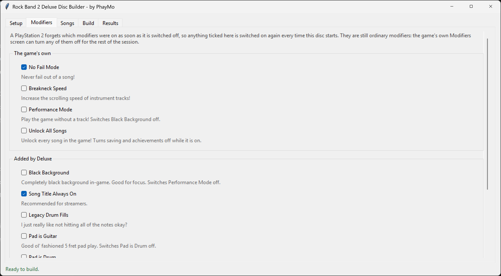

# Rock Band 2 Deluxe Disc Builder

by PhayMo

Builds a custom Rock Band 2 Deluxe disc for the PlayStation 2 from folders of
Clone Hero songs. You choose the songs, it converts the audio, charts, album art
and background video into the formats the console expects, packs them into the
game's archive and writes a bootable ISO. Everything it produces has been tested
on real hardware.

## What you need

- **Windows.** The chart converter runs Magma, the official Rock Band compiler.
- **Your own copy of Rock Band 2 Deluxe (Custom Edition) for PS2**, unpacked - the folder holding
  `SLUS_218.00` and `gen\MAIN_0.ARK`.
- **Songs in Clone Hero layout**: `notes.mid` or `notes.chart`, `song.ini`, the
  audio and `album.png`. Separate stems are ideal, since the game can then mute
  each part as it is missed, but one mixed `song.ogg` works too, as do `.wav`,
  `.mp3` and `.opus`.
- **`ps2str.exe`** from Sony's PS2 SDK, which cannot be distributed with this.
  Everything else - FFmpeg, Onyx, dtab, Mackiloha - the Setup page downloads.
- **Python 3.8 or newer** if you run from the source. The packaged `.exe` needs
  nothing installed.
- About 30 GB free for the work folder. A hundred-song disc takes a couple of
  hours.

A song offers exactly the parts its chart plays, so a guitar-only chart becomes a
guitar-only song. Stems for a part the chart skips go into the backing track
rather than being dropped. Lyrics on their own are not a vocals part.

Eleven background clips come with it, in `venues\`, one picked per song and
looped behind it - drop your own in there instead. A song holding its own `video`
or `background` file plays that, in any format Clone Hero accepts, and can be
moved a little either way to suit; `song.ini`'s `video_start_time` is honoured
where you have not. Or set *Background* to *Black* and have none at all, which
fits far more songs.

Black a video came with is cut off before it is framed, so a picture boxed inside
a file of another shape fills the screen rather than sitting in the middle of it.
Where the picture itself is a different shape from the screen there is no answer
that costs nothing, so *A song's own video* decides: keep all of it, with black
above and below, or fill the screen and crop what will not fit.

*Video quality* is what each of those backgrounds costs on the disc, since two
thirds of a song's size is its video. The default 1500 kbps is a little under what
the game itself used, which was 2500.

## Making it your disc

*Title screen* on the Setup page changes what the title screen and the main menu are
headed with - both, since it is one logo drawn twice.

*Logo* is the picture. *Deluxe logo* is the one this program comes with, which is the
Deluxe logo drawn larger than the disc's own. *Browse* takes a picture of yours
instead: a PNG with a see-through background, and wide rather than tall, since it goes
into a space four times as wide as it is high. Left empty, whatever logo the release
already has is left alone.

*Words under it* draws whatever you type beneath that logo: *Beatles Edition*, the
name of a setlist, a date. Up to 42 letters, and a long one is drawn smaller rather
than running off the edge. With nothing typed, the picture gets those rows to itself
and comes out larger still.

## Modifiers

Deluxe's modifiers are things you turn on for a session: No Fail, Breakneck Speed,
Auto Kick, Autoplay, and a dozen more Deluxe added on top of the game's own. A
PlayStation 2 forgets every one of them the moment it is switched off, so anyone who
always plays with one has to go and tick it again on each boot.

The **Modifiers** page decides which of them the disc starts with switched on, every
time. They stay ordinary modifiers: the Modifiers screen in the game can turn any of
them off again for the rest of the session.

Twelve are offered, each with the game's own words for what it does. Deluxe registers
eighteen on this console, but six of them do nothing on a PS2 however they are switched
on - Auto Kick and Freestyle Drums ask the engine for methods this build has not got,
Sync Difficulty Speeds is only read by code compiled for the other consoles, and nothing
in the release reads Midi Drum Bass Kick Fix, No SELECT in Practice or Awesomeness
Detection at all - so rather than offer a switch that changes nothing, they are left off
the page. Auto Kick is the one worth knowing about: it still stops the game saving while
it is on, so it costs scores and gives nothing back.

Some of them argue. Black Background and Performance Mode switch each other off,
Jukebox Mode brings Autoplay and Performance Mode on with it, and Autoplay, Auto Kick,
Unlock All Songs and Jukebox Mode stop the game saving anything while they are on. Tick
a pair like that and the page says what the disc will actually start with.

## Experimental pro drums

A chart made for pro drums says which of its yellow, blue and green notes are cymbals
rather than toms, and the PlayStation 2 game throws that away: both come out as the
same coloured bar. *Cymbal notes* on the Setup page draws them apart.

A cymbal becomes a round plate lying flat on the deck, silver around the rim with a
raised bell in the middle, and a tom keeps the bar it has always had. Both keep their
shape inside overdrive, where the game otherwise draws one white bar for everything.
Nothing else changes: a chart that says nothing about cymbals plays exactly as before,
and the kick and the red lane are left alone, red having no cymbal to tell apart. Both
kits are done, left-handed as well as right.

It is the only setting here that changes the game's own program rather than what is on
the disc beside it. The routine that picks a note's shape had no way to ask about
cymbals, so 44 of its instructions are rewritten to ask, and the disc carries that
`SLUS_218.00` instead of the release's. The folder you pointed at is never written to:
the patched copy is made in the work folder, fresh every build.

## Running it

Unzip the release and run `RB2DX Disc Builder.exe`. The first start takes a good
twenty seconds while it unpacks itself, with nothing on screen until the window
appears. From the source, `run.bat`, or `python -m rb2dx gui`.

Work through the pages in turn: **Setup** for your folders and tools, **Modifiers**
if you want any of them on from the start, **Songs** to scan and tick what you want,
**Build**, then **Results**. Songs that cannot be converted are set aside with a
reason rather than stopping the build.

Burn the ISO to a DVD-R, or run it from a hard drive loader.

## Playing in an emulator

A real PS2 boots the ISO this tool writes; PCSX2 does not. With identical files on
it, an image written by ImgBurn boots where one written here fails, so it is in
how the image is put together rather than anything on the disc.

Tick *Also save the disc's files in a folder* on the Setup page, then make the
image yourself in [ImgBurn](https://www.imgburn.com/): *Build* mode, destination
an image file, that folder as the source, and file system *ISO9660 + UDF* with
UDF revision 1.02. The folder costs almost no space, its files being hard links
to what the build already wrote.

## The command line

Everything the interface does is available without it:

    python -m rb2dx setup --base-game "D:\RB2DXCE-PS2" --work "D:\rb2dx\work"
    python -m rb2dx setup --add-library "D:\Charts\Rock Band 3"
    python -m rb2dx setup --download
    python -m rb2dx setup --background black
    python -m rb2dx setup --screen 16:9
    python -m rb2dx setup --song-video fill
    python -m rb2dx setup --video 2500
    python -m rb2dx setup --title-text "Beatles Edition"
    python -m rb2dx setup --title-art deluxe
    python -m rb2dx setup --title-art "D:\Art\my logo.png"
    python -m rb2dx setup --modifiers nofail,autokick
    python -m rb2dx setup --modifiers none
    python -m rb2dx setup --wide-mix yes
    python -m rb2dx setup --pro-drums yes
    python -m rb2dx setup --disc-folder yes
    python -m rb2dx scan
    python -m rb2dx plan
    python -m rb2dx nudge "D:\Charts\Some Song" 4.5
    python -m rb2dx nudge "D:\Charts\Some Song" --detect
    python -m rb2dx build

Both share one settings file, in `%LOCALAPPDATA%\rb2dxbuilder\settings.json`.

## When something goes wrong

**A tool will not download.** FFmpeg falls back to a GitHub mirror, and a
certificate this machine refuses is tried again against a bundled list, so
pressing the button again is usually all it takes. *Locate* will take a copy you
download yourself.

**A song is left off the disc.** The Results page says which stage failed and
why, in the converter's own words, with the path to its log. Missing album art
and charts Magma rejects are the usual causes. Plenty of what a Clone Hero chart
gets away with is repaired on the way through rather than costing you the song:
track numbers of zero, chords of four or five gems, nested vocal phrases, notes
with no syllable on them, a stray second `[end]` marker, a solo or a sung phrase
running into the big rock ending, an ending whose lanes do not all finish
together. Failures are remembered
so later builds do not stall on the same song; *Try the failed songs again*
clears that.

**The disc will not boot.** Check the ISO is within the size limit and that the
game folder you pointed at boots as it is. In PCSX2 it never will - see above.

**A song crashes as it loads.** Almost always a song list entry promising
something the song cannot deliver, an instrument with no audio channels or
nothing charted for it. Nothing the game ships breaks that rule and nothing built
here should either, so if a song still crashes, please report it.

## How it works

Songs build in parallel, each one through: mixing the stems at 22050 Hz into one
channel group per part the chart plays; converting the chart with Onyx and Magma;
turning the album art into a 256x256 paletted PS2 texture; encoding the mix to
PlayStation 4-bit ADPCM; and encoding the background to MPEG-2 and muxing the two
into a `.pss`. Then the songs and the compiled song list go into the game's
archive, an ISO9660/UDF image is written, and every shipped file is read back out
of the archive and compared.

Work is cached per song, so adding one song to a finished disc builds that one.
Changing a setting only redoes the stages that read it.

## Packaging it yourself

    pip install pyinstaller
    pyinstaller rb2dxbuilder.spec

That writes `dist\RB2DX Disc Builder\`, about 90 MB, ready to zip. It is a folder
rather than a single file so the `venues` folder stays visible: clips dropped in
there are used without changing any setting.

## Thanks

- The **Rock Band 2 Deluxe** team, for the mod this builds on.
- **Onyx Music Game Toolkit** and **dtab**, both by mtolly, for chart conversion
  and for reading and writing the song list.
- **Mackiloha** by PikminGuts92, for the archive and texture tools.
- **FFmpeg**, for everything audio and video.
- **Lysix**, for their amazing tutorial.

## License

MIT, in `LICENSE`. The background clips in `venues\` are not mine and are only
there as a convenience - replace them with your own if you plan to redistribute
this.
